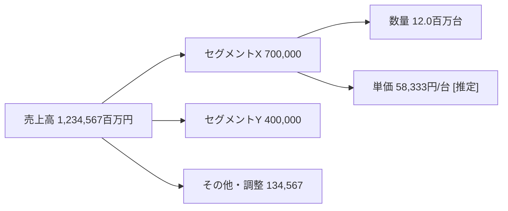

# diagrams.md — 図解の仕様

## 図はチェック機構でもある

収益分解ツリーで内訳合計が全社値に合わなければ、どこかの数値か理解が間違っている。
図は「説明のため」ではなく**整合を目視で検出するため**に描く。だから数値には必ずE-IDを付ける。

## ファイル形式（`figures/F-xx.md`）

```markdown
# F-01 収益分解ツリー（25年3月期）

## 図


## データ表
| 項目 | 値 | 単位 | 期 | 根拠 | 区分 |
|---|---|---|---|---|---|
| 売上高 | 1234567 | 百万円 | 25年3月期 | E-0007 | 事実 |
| セグメントX 売上 | 700000 | 百万円 | 25年3月期 | E-0008 | 事実 |
| セグメントX 数量 | 12.0 | 百万台 | 25年3月期 | E-0012 | 事実 |
| セグメントX 単価 | 58333 | 円/台 | 25年3月期 | 計算:E-0008,E-0012 | 計算 |
| セグメントY 売上 | 400000 | 百万円 | 25年3月期 | E-0009 | 事実 |
| その他・調整 | 134567 | 百万円 | 25年3月期 | 計算:E-0007,E-0008,E-0009 | 計算 |

## 整合チェック
- 内訳合計 = 全社値: 700000+400000+134567 = 1234567 ✓
- 単価 = 売上/数量: 700000百万円 ÷ 12.0百万台 = 58,333円/台

## 読み取り
（2〜4行。図から何が言えるか、どの仮説に効くか）
```

**必須**: データ表の `根拠` 列。`E-xxxx` / `計算:E-...,E-...` / `[推定]` のいずれか。
空欄があると `check_b` が `B06 FIGURE_UNSOURCED` でFAILにする。

## 最小図解セット

| ID | 図 | 目的 | 型 |
|---|---|---|---|
| F-01 | 収益分解ツリー | 売上を「動く変数」まで分解し、どこを見れば業績が読めるかを決める | mermaid flowchart |
| F-02 | バリューチェーン＋競合マップ | 川上/川下の力関係、価格決定力の所在 | flowchart / 2軸マップ |
| F-03 | 業績・指標時系列（5期以上） | トレンドと変曲点。四半期は季節性に注意 | 表＋折れ線（SVG可） |
| F-04 | 仮説→ドライバ→KPIツリー | 仮説を観測可能な指標に接続し、崩壊条件を定義 | mermaid flowchart |
| F-05 | リスク／感応度 | 主要業績変数±で利益がどう動くか。株価指標まで伸ばす場合は株価証拠のE-IDと基準時点を明記（全て`[推定]`） | 表（トルネード可） |

対象が業界・マクロの場合は F-01 を「市場規模分解（TAM→SAM→自社SOM 等）」、
F-02 を「プレイヤー相関図」、F-03 を「需給・価格・出荷の時系列」に読み替える。

## 描画手段

- 構造図は **Mermaid** を第一選択（テキストで差分が取れ、数値の書き換え跡が追える）
- 時系列・感応度は表＋SVG。画像生成は使わない（数値が検証できないため）
- 図中の数値表記は、データ表の値と桁・単位を一致させる（表示上の丸めは可。丸めたら表に注記）

## 注意

- **推定値は図の中でも `[推定]` を落とさない。** 図に入った瞬間に事実に見えるのが最大の事故要因
- 期の異なる数値を1つの図に混ぜない。混ぜる必要があるときは各ノードに期を明記
- 競合比較図では、**会計基準・セグメント定義の違い**を注記なしに並べない
- 株価指標を図に入れるときは、株価の基準時点とEPS/BPSの対象期を欄外に明記する。
  時点の違う数字を1つの棒グラフに並べると、比較として成立しない
